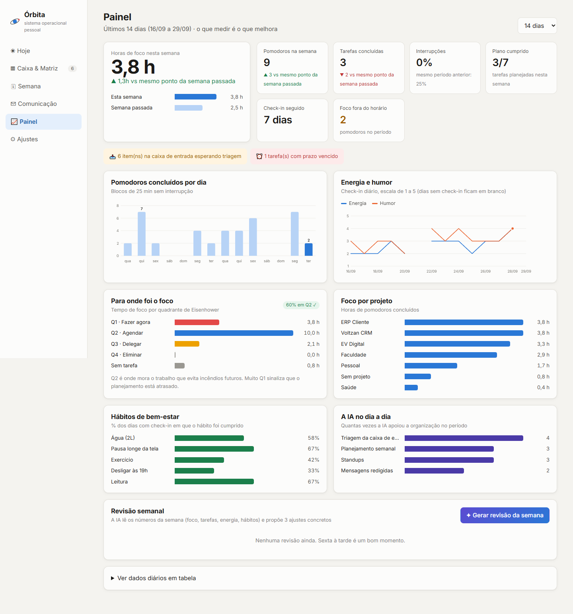
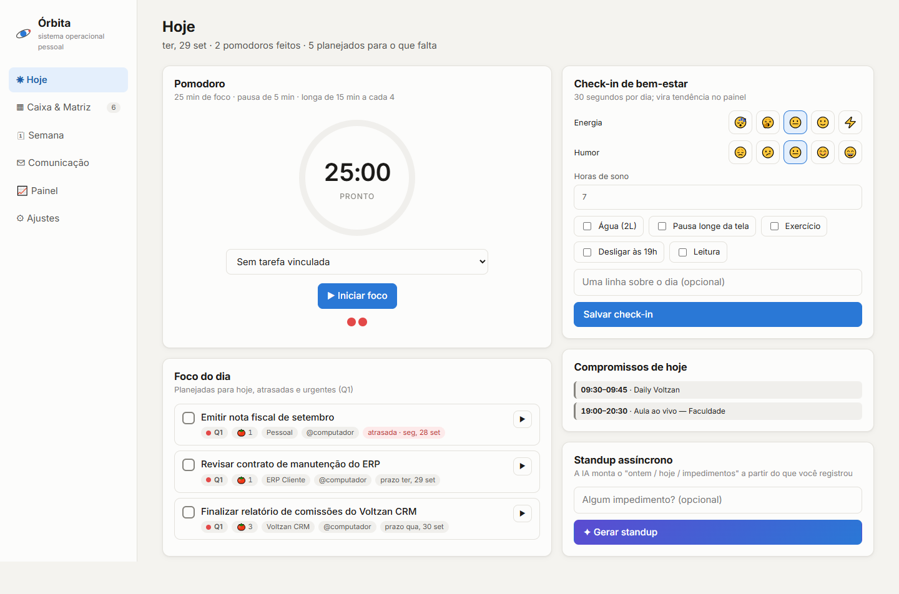
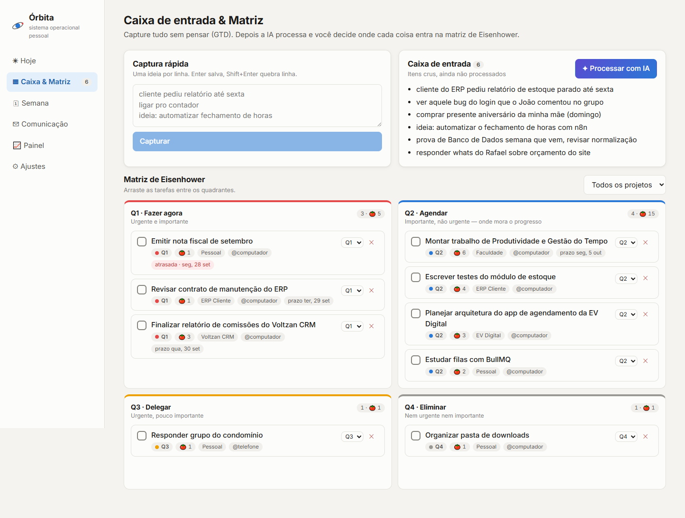
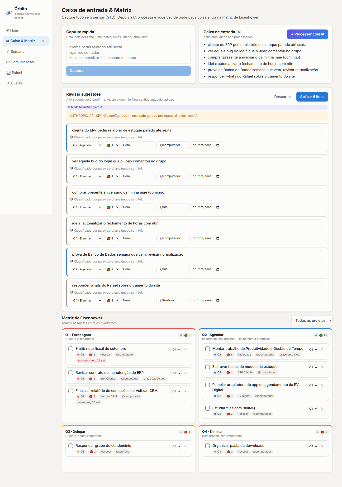
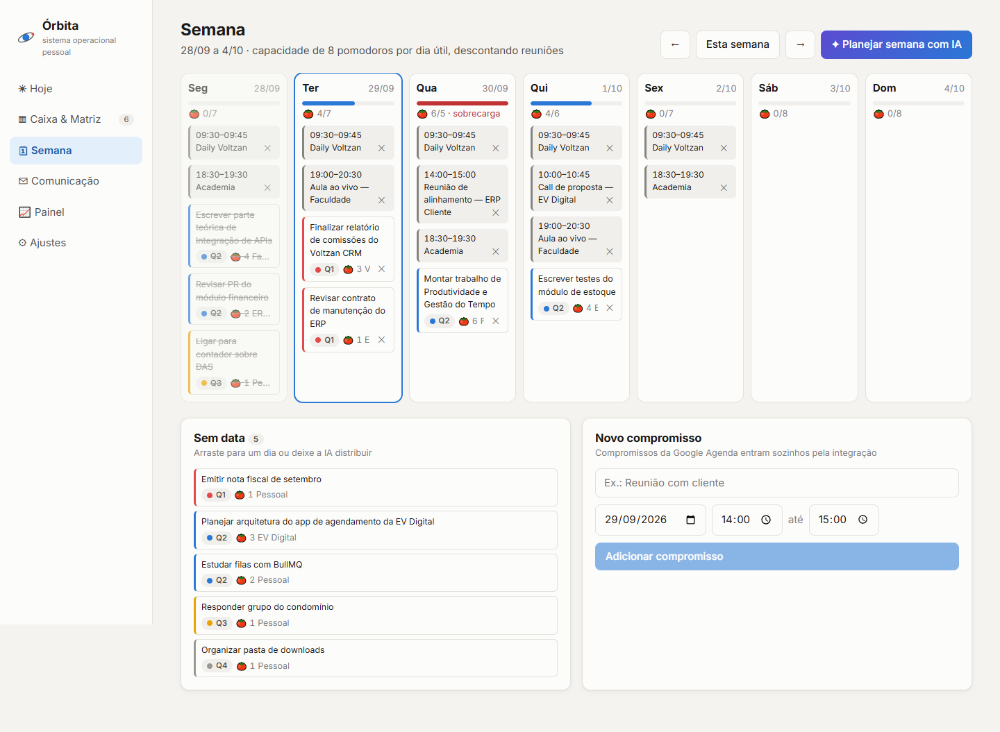
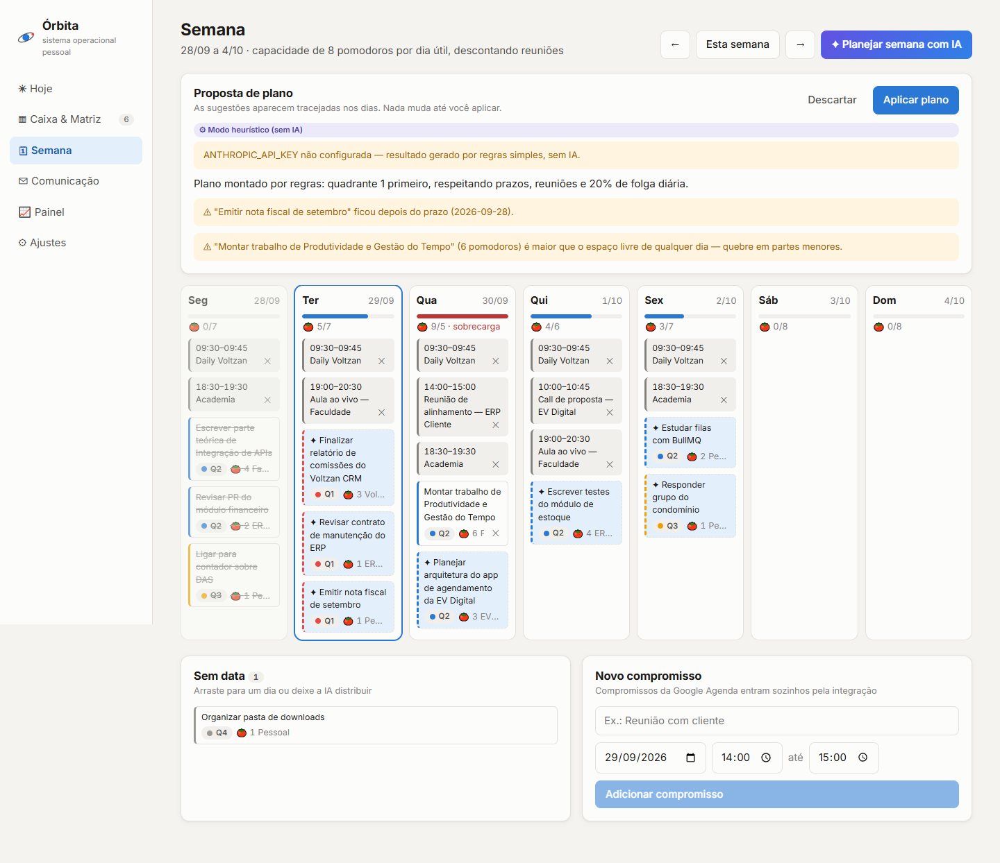
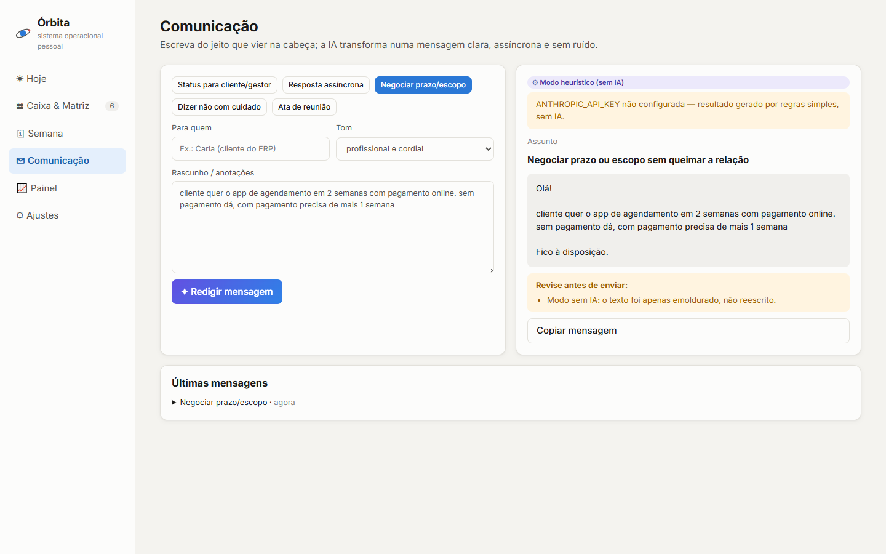
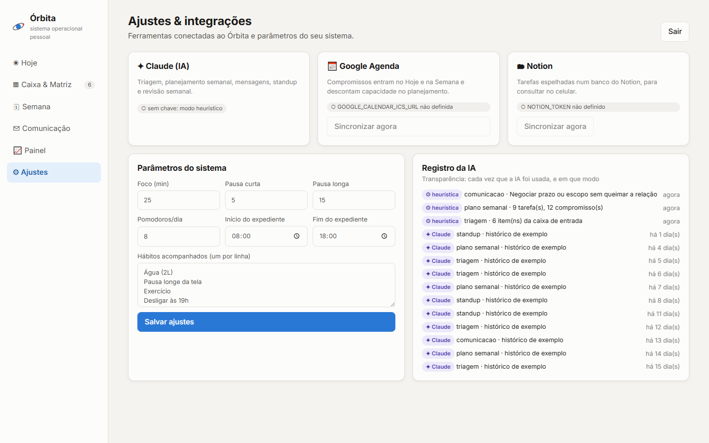

# Órbita: Sistema Operacional Pessoal

Projeto da disciplina **Produtividade e Gestão do Tempo**. O Órbita é o meu *Personal Operating System (POS)*: um app web que junta num só lugar a captura de demandas, a priorização, o planejamento da semana, os blocos de foco, a comunicação profissional e o acompanhamento de energia e hábitos. Usa Inteligência Artificial (OpenAI, com suporte também ao Claude da Anthropic) como copiloto em cada etapa e se integra à **Google Agenda** e ao **Notion**.

> 🔗 **Acesse:** https://orbita.gustavomartins.dev
> 🎥 **Vídeo pitch:** _[link do YouTube/Loom]_
> 📄 **Parte teórica:** [docs/parte-teorica.md](docs/parte-teorica.md)



---

## Descrição do sistema

A ideia central é que **nada fica na cabeça**: tudo o que chega (pedido de cliente, ideia, conta a pagar, prova da faculdade) é capturado numa caixa de entrada e passa por um fluxo fixo até virar um bloco de foco na agenda, que depois vira dado no painel.

| Módulo | O que faz | Método aplicado |
|---|---|---|
| **Caixa de entrada** | Captura rápida, uma ideia por linha, sem precisar classificar na hora | GTD (captura) |
| **Triagem com IA** | A IA reescreve cada item como próxima ação, sugere quadrante, estimativa em pomodoros, contexto, projeto e prazo. **Você revisa e aprova** | GTD (esclarecer) + Eisenhower |
| **Matriz de Eisenhower** | Quadro 2×2 com arrastar e soltar (ou seletor, no celular) | Eisenhower / Covey (Q2) |
| **Semana** | Colunas por dia com compromissos, tarefas e barra de carga (capacidade − reuniões). A IA propõe a distribuição e você aplica | Planejamento semanal + time blocking |
| **Hoje** | Foco do dia, timer Pomodoro vinculado à tarefa, compromissos, check-in de bem-estar e standup | Pomodoro + check-in diário |
| **Comunicação** | Transforma rascunho solto em mensagem clara: status, resposta assíncrona, negociação de prazo, "dizer não", ata de reunião | Comunicação assíncrona |
| **Painel** | Horas de foco, pomodoros por dia, foco por quadrante (% em Q2), foco por projeto, energia e humor, hábitos, uso da IA, e a **revisão semanal gerada pela IA** | GTD (revisão semanal) |
| **Ajustes** | Integrações, parâmetros (duração do pomodoro, capacidade diária, expediente, hábitos) e registro transparente de cada uso da IA | — |

## Ferramentas utilizadas

| Ferramenta | Papel no sistema |
|---|---|
| **OpenAI (Responses API)**, modelo configurável (padrão `gpt-5.4-mini`) | Triagem da caixa de entrada, planejamento semanal, redação de mensagens, standup e revisão semanal. Saída estruturada (JSON validado por schema Zod) pra que o resultado vire dado no sistema, e não só texto. O provedor é trocável: com `ANTHROPIC_API_KEY` o mesmo fluxo roda no **Claude** (`claude-opus-5-5`) |
| **Google Agenda** | Fonte dos compromissos, lida pelo endereço iCal secreto (sem OAuth). Eventos recorrentes são expandidos. Os compromissos descontam capacidade no planejamento |
| **Notion** | Espelho das tarefas num banco do Notion (criado automaticamente), para consultar no celular e ter um "segundo cérebro" fora do app |
| React + Vite + TypeScript | Frontend (SPA) |
| Node.js + Express + TypeScript | Backend / API |
| SQLite (`node:sqlite`) | Banco local: tarefas, pomodoros, compromissos, check-ins, revisões, registro da IA |
| Docker Swarm + Traefik + GHCR | Deploy na VPS própria, com HTTPS |

### Como a IA foi usada, e com que limites

- **A IA sugere, eu decido.** Triagem e plano semanal aparecem como *proposta* (itens tracejados, campos editáveis). Nada é gravado sem o clique em "Aplicar".
- **Nada inventado.** O prompt de comunicação proíbe criar fatos, datas ou números. O que faltar vira `[ASSIM]` e aparece em "Revise antes de enviar".
- **Transparência.** Todo resultado mostra um selo com a IA e o modelo usados (ou "Modo heurístico"), e a tela de Ajustes lista cada uso.
- **Nunca trava.** Sem chave de API, ou se a API falhar, cada função cai num fallback por regras (palavras-chave, ordenação por quadrante e prazo) e avisa na tela.
- **Recusa tratada.** Se o modelo recusar ou devolver algo fora do schema, a resposta não é usada e o sistema cai no fallback com aviso.

## Fluxo de organização

```
 CAPTURAR            ESCLARECER            ORGANIZAR              EXECUTAR              REVISAR
 ─────────           ──────────            ─────────              ────────              ───────
 Caixa de   ──IA──▶  Próxima ação   ──▶   Matriz de     ──IA──▶  Semana (dia a dia) ─▶ Painel +
 entrada             + quadrante          Eisenhower             Hoje + Pomodoro       revisão semanal
 (1 ideia/linha)     + pomodoros          (Q1..Q4)                 ▲                    com IA
                     + prazo                                       │                      │
                                          Google Agenda ───────────┘                      │
                                          (compromissos)                                  │
                                                                                          │
         ◀──────────────────── ajustes da próxima semana ◀────────────────────────────────┘

 Notion ◀── espelho das tarefas          Comunicação com IA ── status, ata, "não", prazo
```

**Rotina que o sistema sustenta:**

1. **Manhã (5 min):** check-in de energia e humor → processar a caixa de entrada com IA → conferir o "Foco do dia" → gerar o standup.
2. **Durante o dia:** blocos de Pomodoro vinculados a tarefas; o que surgir vai pra captura rápida, sem interromper o foco.
3. **Segunda (15 min):** sincronizar a agenda → "Planejar semana com IA" → ajustar e aplicar.
4. **Sexta (15 min):** revisão semanal com IA no Painel → escolher os 3 ajustes da próxima semana.

## Prints

| | |
|---|---|
| **Hoje** · Pomodoro, foco do dia, check-in, standup  | **Caixa & Matriz**  |
| **Triagem com IA** · sugestões editáveis  | **Semana** · carga por dia  |
| **Plano semanal com IA** · proposta tracejada  | **Comunicação com IA**  |
| **Painel**  | **Ajustes & integrações**  |

## Como utilizar

### Rodando localmente

Requisitos: Node.js **22.13+** (usa o módulo nativo `node:sqlite`).

```bash
# backend
cd backend
cp .env.example .env        # defina APP_PASSWORD e, se quiser, OPENAI_API_KEY / Google / Notion
npm install
npm run seed                # opcional: 3 semanas de histórico de exemplo para o painel
npm run dev                 # http://localhost:3001

# frontend (outro terminal)
cd frontend
npm install
npm run dev                 # http://localhost:5173  (proxy de /api para o backend)
```

Ou tudo em containers: `docker compose -f docker-compose.dev.yml up --build` → http://localhost:5173.

### Configurando as integrações

| Variável (`backend/.env`) | Onde conseguir |
|---|---|
| `APP_PASSWORD` | Senha de acesso ao sistema (um usuário só) |
| `SESSION_SECRET` | Qualquer string longa e aleatória |
| `OPENAI_API_KEY` | platform.openai.com → API keys. Sem chave de IA, o sistema funciona no modo heurístico |
| `OPENAI_MODEL` | Opcional. Padrão `gpt-5.4-mini` (barato e rápido); para respostas mais elaboradas, `gpt-5.5` |
| `ANTHROPIC_API_KEY` / `AI_PROVIDER` | Opcional: usar o Claude no lugar da OpenAI (`AI_PROVIDER=anthropic` se as duas chaves existirem) |
| `GOOGLE_CALENDAR_ICS_URL` | Google Agenda → Configurações da agenda → *Integrar agenda* → **Endereço secreto no formato iCal** |
| `NOTION_TOKEN` | notion.so/my-integrations → nova integração interna → token |
| `NOTION_PARENT_PAGE_ID` | ID de uma página do Notion compartilhada com a integração (menu ••• → *Conexões*). O banco "Órbita — Tarefas" é criado dentro dela na primeira sincronização |

Depois, em **Ajustes**, use "Sincronizar agora" para a Google Agenda e para o Notion.

### Deploy (VPS)

1. O push em `main` dispara o GitHub Actions, que faz o build das imagens **amd64** (arquitetura da VPS) e publica no GHCR (`ghcr.io/gustavo9br/orbita-backend` e `orbita-frontend`).
2. No Portainer: **Stacks → Add stack → Web editor**, cole o [docker-compose.prod.yml](docker-compose.prod.yml).
3. Em **Environment variables → Load variables from .env file**, carregue o seu `vps.env` (copiado de [vps.env.example](vps.env.example) e preenchido; ele não é versionado).
4. Deploy. O Traefik roteia `orbita.gustavomartins.dev/api` para o backend e o resto para o frontend. O SQLite fica no volume `orbita-data`, por isso o backend roda com **uma réplica só**.

O compose não contém nenhum segredo, só referências `${VARIAVEL}`; `APP_PASSWORD` e `SESSION_SECRET` são obrigatórias e o deploy falha com mensagem clara se faltarem.

## Estrutura do repositório

```
orbita/
  backend/
    src/
      server.ts            rotas, login e sessão por cookie assinado
      db.ts                schema SQLite e ajustes
      lib/ai.ts            as 5 funções de IA (OpenAI ou Claude + fallback heurístico)
      lib/calendar.ts      Google Agenda (iCal, eventos recorrentes)
      lib/notion.ts        sincronização com o Notion
      routes/              tarefas, IA, painel, rotina (pomodoro, semana, check-in, integrações)
      seed.ts              histórico de exemplo
  frontend/
    src/
      pages/               Hoje, Matriz, Semana, Comunicação, Painel, Ajustes
      components/          gráficos em SVG e componentes de UI
      lib/usePomodoro.ts   timer (continua rodando entre abas e após recarregar)
  docs/
    parte-teorica.md       entregável 1
    roteiro-video.md       roteiro do pitch (até 4 min)
    prints/
  docker-compose.dev.yml
  docker-compose.prod.yml      stack de produção (lê as variáveis do vps.env)
  vps.env.example
  .github/workflows/deploy.yml
```
